<h1 align="center">
   Graduação em Engenharia de Software
</h1>

<p align="center">
   
</p>

<p align="center">
    Projeto de Bloco: Arquitetura de Computadores, Sistemas Operacionais e Redes
</p>

<p align="center">
  
  
  
  
  
  
  
  
  
  
</p>

## Tabela de Conteúdo

- [Tabela de Conteúdo](#tabela-de-conte%C3%BAdo)
- [Sobre o Projeto](#sobre-o-projeto)
  - [Feito Com](#feito-com)
  - [Linha do tempo](#linha-do-tempo)
- [Começando](#come%C3%A7ando)
  - [Pré-requisitos](#pr%C3%A9-requisitos)
  - [Instalação](#instala%C3%A7%C3%A3o)
  - [Instale as bibliotecas](#instale-as-bibliotecas)
  - [Rode o Server](#rode-o-server)
  - [Rode o Client](#rode-o-client)
- [Contribuição](#contribui%C3%A7%C3%A3o)
- [Contato](#contato)

## Sobre o Projeto
<p align="center">
  
<p>
  
A proposta do Projeto de Bloco de Arquitetura de Computadores, Sistemas Operacionais e Redes projeto é um software cliente-servidor em Python que explore conceitos de arquitetura de redes, arquitetura de computadores e/ou de sistemas operacionais, acompanhado de relatório explicativo. </br>
Esse software cliente-servidor possui as seguintes funcionalidades:
- Capturas das informações dos diretórios, como nome, tamanho, localização, data de criação, data de modificação, tipo, etc.
- Capturas das informações dos processos do sistema, como PID, nome do executável, consumo de processamento, consumo de memória.
- Escalonamento das chamadas das funções com o módulo ‘sched’ e medição do tempo total utilizado por cada chamada com o módulo ‘time’.
- Informações sobre as máquinas pertencentes à sub-rede do IP específico.
- Informações sobre as portas dos diferentes IPs obtidos nessa sub-rede.
- Informações de interfaces de redes (exemplos: interfaces disponíveis, IP, gateway, máscara de subrede, etc.).

### Feito Com

Abaixo segue o que foi utilizado na criação deste projeto:

- [Visual Studio Code](https://code.visualstudio.com/) - Um editor de código-fonte desenvolvido pela Microsoft para Windows, Linux e macOS. Ele inclui suporte para depuração, controle Git incorporado, realce de sintaxe, complementação inteligente de código, snippets e refatoração de código.

- [pyhton](https://www.python.org/) - Uma linguagem de programação de alto nível, interpretada de script, imperativa, orientada a objetos, funcional, de tipagem dinâmica e forte.

- [psutil](https://pypi.org/project/psutil/) - Uma biblioteca de plataforma cruzada para recuperar informações sobre processos em execução e utilização do sistema (CPU, memória, discos, rede, sensores) em Python. É útil principalmente para monitoramento de sistema , criação de perfil e limitação de recursos de processo e gerenciamento de processos em execução. 

- [py-cpuinfo](https://pypi.org/project/py-cpuinfo/) - Uma biblioteca que obtém informações da CPU com Python puro. O Py-cpuinfo deve funcionar sem quaisquer programas ou bibliotecas extras, além do que o seu sistema operacional oferece. Não requer nenhuma compilação (C / C ++, montagem, etc.) para usar. Funciona com Python 2 e 3.

- [matplotlib](https://matplotlib.org/) - Uma biblioteca de software para criação de gráficos e visualizações de dados em geral, feita para e da linguagem de programação Python e sua extensão de matemática NumPy.

- [netifaces](https://pypi.org/project/netifaces/) - Uma biblioteca portátil de terceiros em Python para enumerar interfaces de rede na máquina local. O netifaces se encarrega de enumerar interfaces, endereços de rede e também preserva a portabilidade.

- [socket](https://docs.python.org/3/library/socket.html) - A programação de soquete é uma forma de conectar dois nós em uma rede para se comunicarem. Um soquete (nó) escuta em uma porta específica em um IP, enquanto outro soquete alcança o outro para formar uma conexão. O servidor forma o soquete do ouvinte enquanto o cliente alcança o servidor.

- [time](https://docs.python.org/3/library/time.html) - Este módulo fornece várias funções relacionadas ao tempo.

- [pickle](https://docs.python.org/3/library/pickle.html) - É usado para serializar e desserializar estruturas de objetos Python, também chamado de empacotamento ou nivelamento. A serialização se refere ao processo de conversão de um objeto na memória em um fluxo de bytes que pode ser armazenado em disco ou enviado por uma rede.

- [os](https://docs.python.org/3/library/os.html) - Este módulo fornece uma maneira simples de usar funcionalidades que são dependentes de sistema operacional.

- [platform](https://docs.python.org/3/library/platform.html) - Este módulo tenta recuperar tantos dados de identificação de plataforma quanto possível.

### Linha do tempo

<details>
<summary>Teste de Performance 3 - TP3</summary>
<br>
Sobre o entregável: <br><br>
- Um aplicativo simples de apresentação gráfica do monitoramento e análise do computador. Ele deverá ser implementado em Python usando módulos como psutil (para capturar dados do sistema computacional) e Pygame (para exibir graficamente os dados).
<br><br>
Funcionalidades implementadas no TP3: <br><br>
- Informações associadas ao processador
<p align="center">
   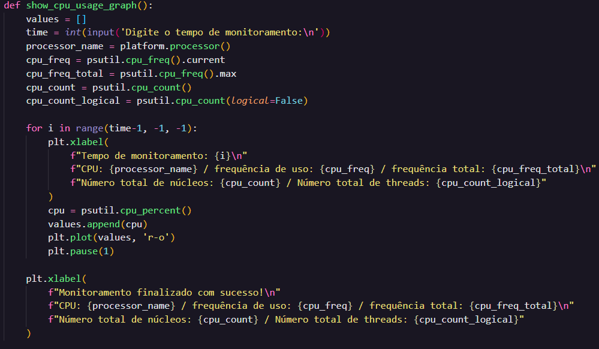
   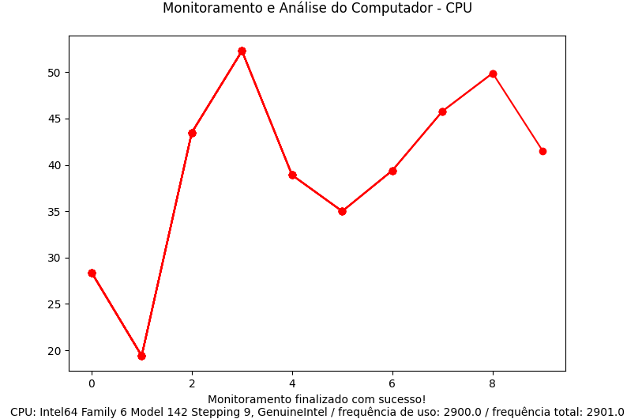
<p>
<br><br>
- Informações associadas à memória
<p align="center">
   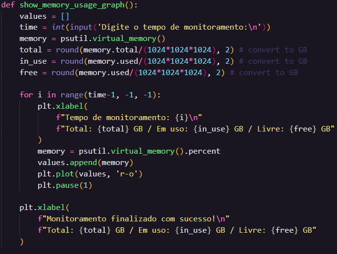
   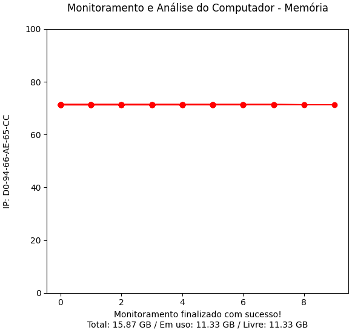
<p>
<br><br>
- Informações associadas ao Disco
<p align="center">
   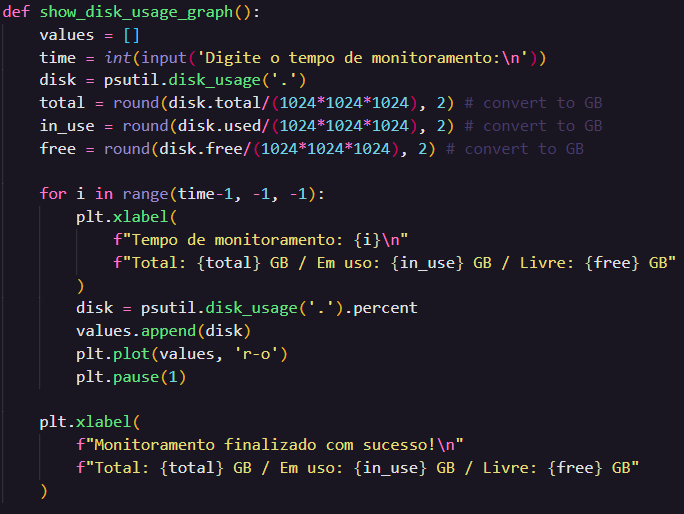
   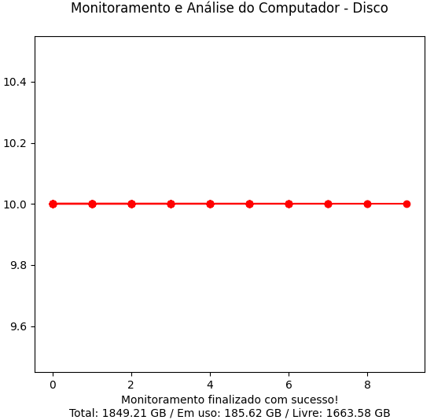
<p>
<br><br>
- Informações associadas ao IP
<p align="center">
   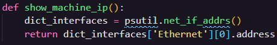
<p>
<br><br>
- Informação de nome/modelo da CPU (brand), arquitetura (arch), palavra do processador (bits), frequência total e frequência de uso da CPU e número total de núcleos (núcleo físico) e threads (núcleo lógico)
<p align="center">
   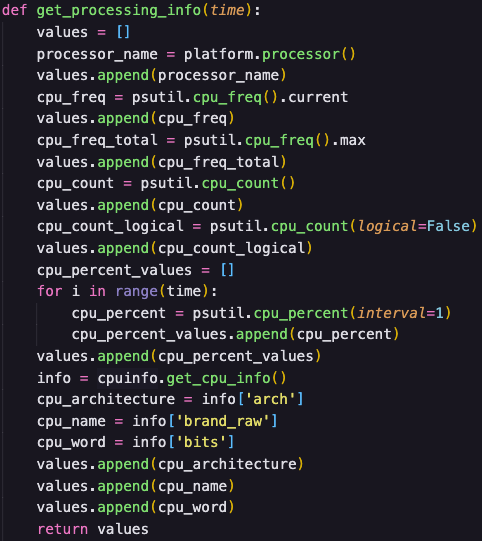
<p>
</details>

<details>
<summary>Teste de Performance 4 - TP4</summary>
<br>
Sobre o entregável: <br><br>
- No Teste de Performance 4, foram introduzidas informações sobre arquivos e diretório especificados e sobre processos em execução no computador.
<br><br>
Funcionalidades implementadas no TP4: <br><br>
- Informações associadas a arquivos e diretórios
<p align="center">
   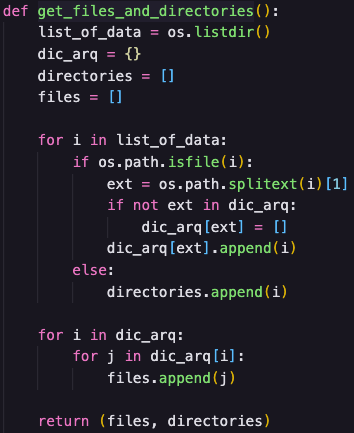
   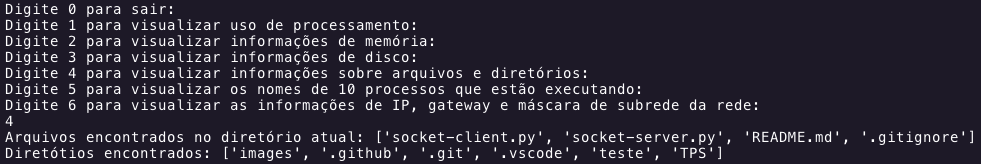
<p>
<br>
- Informações associadass a processos em execução no computador
<p align="center">
   
   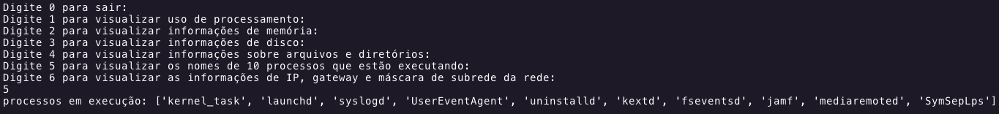
<p>
</details>

<details>
<summary>Teste de Performance 6 - TP6</summary>
<br>
Sobre o entregável: <br><br>
- No Teste de Performance 6, foram introduzidas informações sobre subrede de um IP especificado e sobre as portas desse IP.
<br><br>
Funcionalidades implementadas no TP6: <br><br>
- Informações sobre as máquinas pertencentes à sub-rede do IP específico
<p align="center">
   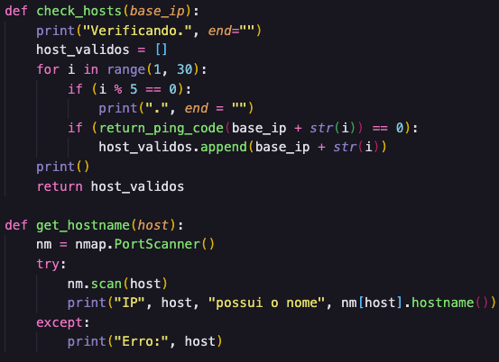
<p>
<br>
- Informações sobre as portas dos diferentes IPs obtidos nessa sub rede
<p align="center">
   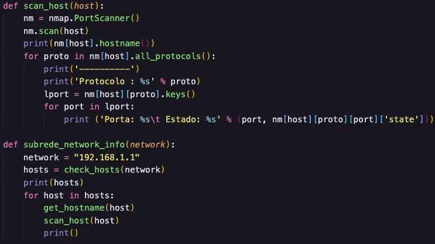
<p>
</details>

<details>
<summary>Teste de Performance 7 - TP7</summary>
<br>
Sobre o entregável: <br><br>
- No Teste de Performance 7, foram introduzidas informações sobre redes do computador.
<br><br>
Funcionalidades implementadas no TP7: <br><br>
- Informações associadas ao IP, gateway e máscara de subrede da rede
<p align="center">
   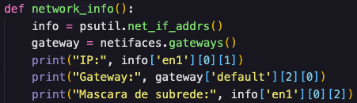
<p>
<br>
- Informações associadass ao uso de dados de rede por interface
<p align="center">
   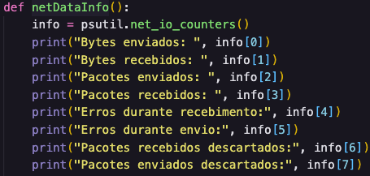
   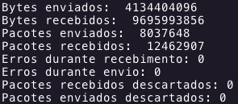
<p>
- Informações associadass ao uso de dados de rede por processos
<p align="center">
   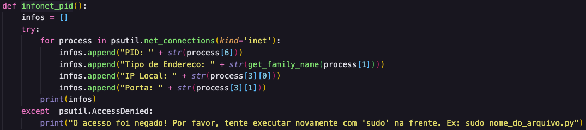
<p>
</details>
   
---

## Começando

Para conseguir utilizar ou visualizar o projeto, seja através do Visual Studio Code ou outro editor de código, siga os passos abaixo:

### Pré-requisitos

Antes de começar, você vai precisar ter instalado em sua máquina as seguintes ferramentas:
- É **necessário** possuir o **[pyhton](https://www.python.org/)** instalado no computador
- É **necessário** possuir o **[psutil](https://pypi.org/project/psutil/)** instalado
- É **necessário** possuir o **[py-cpuinfo](https://pypi.org/project/py-cpuinfo/)** instalado
- É **necessário** possuir o **[matplotlib](https://matplotlib.org/)** instalado
- É **necessário** possuir o **[netifaces](https://docs.python.org/3/library/socket.html)** instalado
- Por fim, é **essencial** ter o **[Git](https://git-scm.com/)** instalado e configurado no computador

### Instalação

Para instalar esse projeto, o processo é bem simples. Basta utilizar o seguinte comando no terminal:

```bash
# Clone este repositório
$ https://github.com/MTevangelista/computer-info-project.git
```

### Instale as bibliotecas

```bash
# Rode os seguintes comandos no terminal
$ pip3 install psutil
$ pip3 install py-cpuinfo
$ pip3 install matplotlib
$ pip3 install netifaces

# Após rodar todos esses comandos, estará pronto para rodar o servidor :)
```

### Rode o Server

```bash
# Rode a aplicação
$ python3 socket-server.py

# O servidor inciará na porta: 9008
```

### Rode o Client

```bash
# Rode a aplicação
$ python3 socket-client.py
```

---

## Contribuição

Contribuições são o que fazem a comunidade open source um lugar incrível para aprender, inspirar e criar. Qualquer contribuição que você fizer será **muito apreciada**.

1. Faça um Fork do projeto
2. Crie uma Branch para sua Feature (`git checkout -b feature/FeatureIncrivel`)
3. Adicione suas mudanças (`git add .`)
4. Comite suas mudanças (`git commit -m 'Adicionando uma Feature incrível!`)
5. Faça o Push da Branch (`git push origin feature/FeatureIncrivel`)
6. Abra um Pull Request

## Contato

👤  **Matheus Evangelista**

[](https://github.com/MTevangelista)
[](https://www.linkedin.com/in/matheus01/)
[](mailto:matheusevangelistadev@gmail.com)
[](https://www.instagram.com/_matheusrj/?hl=pt-br)
